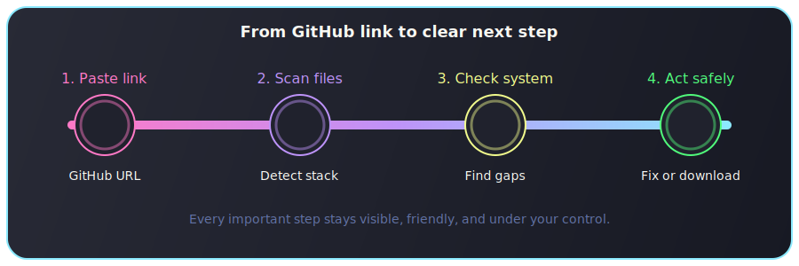

<p align="center">
  
</p>

<p align="center">
  <strong>RepoReady</strong><br>
  Scan a GitHub repo. Learn exactly what your machine is missing. Download only when you are ready.<br>
  <sub>Created by CodeAhmad</sub>
</p>

<p align="center">
  
  
  
  
  
</p>

<p align="center">
  
</p>

## Why RepoReady

RepoReady turns a GitHub URL into a clear setup diagnosis inside your terminal. It inspects the repository files, detects the language and tooling the project needs, compares them with your own machine, and tells you plainly what is ready, what is missing, and what should happen next.

If your machine is already ready, RepoReady can ask whether you want the project downloaded for you. If something is missing, it tells you exactly what language or tool you need before you waste time guessing.

## What You Get

| Feature | What it gives you |
| --- | --- |
| Deep file scan | Reads manifests and source files, not just the repository name |
| Clear diagnosis | Tells you the detected language, evidence, and missing tools |
| System comparison | Shows what your computer already has and what it still needs |
| Safe help flow | Shows commands first and asks before doing anything |
| Ready-state download | Offers to download the project only after your machine is prepared |

## How It Works

<p align="center">
  
</p>

1. Paste a GitHub repository link.
2. RepoReady scans the files and detects the project stack.
3. It checks your system for the required language and tools.
4. It explains the missing pieces or offers to download the repo when you are ready.

## Highlights

- Beautiful terminal-only UI with pastel colors, rounded boxes, animated scan flow, and friendly prompts
- Recursive repository inspection, not just root-folder guessing
- Language detection from manifest files and source-file evidence
- System checks tailored to the repository's actual requirements
- Safe guided repair flow for supported missing tools
- Optional project download when your machine is ready
- Friendly handling for private repositories through `GITHUB_TOKEN`

## Quick Start

```bash
git clone https://github.com/emberrenewed/repoready-cli.git
cd repoready-cli
go mod tidy
go run main.go https://github.com/user/repo
```

Or run RepoReady without a URL and paste one when prompted:

```bash
go run main.go
```

## Example Flow

```text
🌸 RepoReady
Cute GitHub project assistant

Project Scan
Repository        BurntSushi/ripgrep
Detected Language Rust
Evidence          Cargo.toml
Required Tools    Git, Rust, Cargo

Your System
Git               Available
Rust              Missing
Cargo             Missing

Diagnosis
Repository language: Rust
Evidence: Cargo.toml
Your system does not have Rust installed.
You must download/install: Cargo, Rust

Should I fix this problem for you now? [y/N]
```

When everything is already installed:

```text
Ready To Download

Your system is ready for this project.
If you continue, RepoReady will download it to:
~/RepoReady/<owner>/<repo>

Do you want me to download this project for you now? [y/N]
```

## Perfect For

- Developers opening an unfamiliar repository for the first time
- Beginners who need a clear answer instead of a wall of setup docs
- Teams that want a friendlier first-run experience for shared projects
- Anyone who wants a terminal tool that feels useful and pleasant at the same time

## Supported Detection

| Area | Supported |
| --- | --- |
| Languages | JavaScript, TypeScript, PHP, Python, Go, Rust, Java, Ruby, Dart / Flutter, C# / .NET |
| Frameworks | React, Vue, Angular, Next.js, Vite, Svelte, Express, NestJS, Laravel, Django, Flask, FastAPI, Rails, Spring Boot, Flutter, React Native, Android, iOS |
| Tools | Git, Node.js, npm, pnpm, yarn, PHP, Composer, Python 3, pip, Go, Cargo, Rust, Docker, Docker Compose, Java, Maven, Gradle, Flutter, Ruby, Bundler, .NET, MySQL, PostgreSQL, MongoDB, Redis |

## Safety Rules

- RepoReady never runs unknown README commands automatically.
- Every repair command is shown before it runs.
- Commands that require administrator access are shown, not silently executed.
- Existing project folders are never overwritten automatically.
- GitHub tokens are read from `GITHUB_TOKEN` and never printed.

## Private Repositories

For private repository access:

```bash
export GITHUB_TOKEN="your_token_here"
```

## Build A Binary

```bash
go build -o repoready .
./repoready https://github.com/user/repo
```

## Project Structure

```text
cmd/
internal/
  github/
  models/
  runner/
  scanner/
  system/
  ui/
main.go
```

## Validation

```bash
go test ./...
```

## Roadmap

- More framework recipes
- Optional JSON output for scripts
- Shell completions
- More OS-aware repair helpers
- Release binaries
- Installable package builds

---

<p align="center">
  Made with 💜 by CodeAhmad
</p>
