<p align="center">
  
</p>

<p align="center">
  <strong>RepoReady</strong><br>
  A cute, polished GitHub project scanner for your terminal.<br>
  <sub>Created by CodeAhmad</sub>
</p>

<p align="center">
  
  
  
  
</p>

<p align="center">
  
</p>

## What RepoReady Does

RepoReady takes a GitHub repository URL, inspects the project files, detects what language and tooling the project needs, compares that against your local machine, and then tells you clearly what is ready and what is missing.

If your system is already ready, RepoReady can ask whether you want the project downloaded for you.

If something is missing, RepoReady tells you:

- what language the repository uses
- the evidence it found in the files
- what your machine already has
- exactly what you still need to install
- whether RepoReady can help with the fix

## Highlights

- Beautiful terminal-only UI with pastel colors, rounded boxes, animated scan flow, and friendly prompts
- Recursive repository inspection, not just root-folder guessing
- Language detection from manifest files and source-file evidence
- System checks tailored to the repository's actual requirements
- Safe guided repair flow for supported missing tools
- Optional project download when your machine is ready
- Friendly handling for private repositories through `GITHUB_TOKEN`

## Quick Start

```bash
git clone https://github.com/emberrenewed/repoready-cli.git
cd repoready-cli
go mod tidy
go run main.go https://github.com/user/repo
```

Or run RepoReady without a URL and paste one when prompted:

```bash
go run main.go
```

## Example Flow

```text
🌸 RepoReady
Cute GitHub project assistant

Project Scan
Repository        BurntSushi/ripgrep
Detected Language Rust
Evidence          Cargo.toml
Required Tools    Git, Rust, Cargo

Your System
Git               Available
Rust              Missing
Cargo             Missing

Diagnosis
Repository language: Rust
Evidence: Cargo.toml
Your system does not have Rust installed.
You must download/install: Cargo, Rust

Should I fix this problem for you now? [y/N]
```

When everything is already installed:

```text
Ready To Download

Your system is ready for this project.
If you continue, RepoReady will download it to:
~/RepoReady/<owner>/<repo>

Do you want me to download this project for you now? [y/N]
```

## Supported Detection

| Area | Supported |
| --- | --- |
| Languages | JavaScript, TypeScript, PHP, Python, Go, Rust, Java, Ruby, Dart / Flutter, C# / .NET |
| Frameworks | React, Vue, Angular, Next.js, Vite, Svelte, Express, NestJS, Laravel, Django, Flask, FastAPI, Rails, Spring Boot, Flutter, React Native, Android, iOS |
| Tools | Git, Node.js, npm, pnpm, yarn, PHP, Composer, Python 3, pip, Go, Cargo, Rust, Docker, Docker Compose, Java, Maven, Gradle, Flutter, Ruby, Bundler, .NET, MySQL, PostgreSQL, MongoDB, Redis |

## Safety Rules

- RepoReady never runs unknown README commands automatically.
- Every repair command is shown before it runs.
- Commands that require administrator access are shown, not silently executed.
- Existing project folders are never overwritten automatically.
- GitHub tokens are read from `GITHUB_TOKEN` and never printed.

## Private Repositories

For private repository access:

```bash
export GITHUB_TOKEN="your_token_here"
```

## Build A Binary

```bash
go build -o repoready .
./repoready https://github.com/user/repo
```

## Project Structure

```text
cmd/
internal/
  github/
  models/
  runner/
  scanner/
  system/
  ui/
main.go
```

## Validation

```bash
go test ./...
```

## Roadmap

- More framework recipes
- Optional JSON output for scripts
- Shell completions
- More OS-aware repair helpers
- Release binaries

---

<p align="center">
  Made with 💜 by CodeAhmad
</p>
